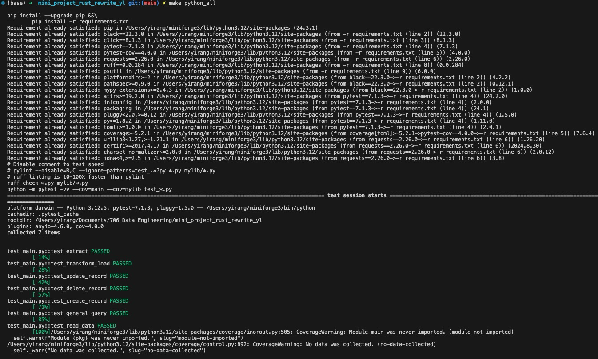
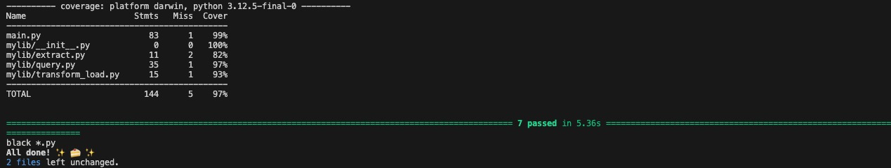
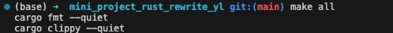
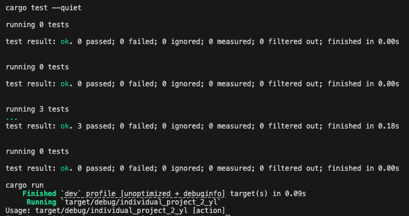

[](https://github.com/nogibjj/mini_project_rust_rewrite_yl/actions/workflows/rustCI.yml)
[](https://github.com/nogibjj/mini_project_rust_rewrite_yl/actions/workflows/pythonci.yml) 

# Mini Project Rust Rewrite

## Requirements
- Take an existing Python script for data processing
- Rewrite it in Rust
- Highlight improvements in speed and resource usage

## Grading Criteria
- Functionality in Rust (20 points)
- Demonstrated improvements (20 points)
- CI/CD pipeline (10 points)
- README.md (10 points)

## Deliverables
- Rust and Python scripts
- Performance comparison report (PDF or markdown)

## Submission 
- Public repository URL

## Goal
This project delivers a comprehensive Data Extraction, Transformation, Loading (ETL) tool, alongside Querying (CRUD) capabilities, developed using Python and Rust each. The process entails taking an existing Python script for ETL-Query and rewrite it in rust using Github Copilot. The project highlights improvements in speed and resource usage after switching Python to Rust.

This toolkit offers a suite of functions for ETL operations on datasets, facilitating queries on a SQLite database. It comprehensively covers CRUD (Create, Read, Update, Delete) operations, logging all queries to two Markdown file, python_query_log.md and rust_query_log.md, to aid in the tracking and analysis of executed commands and comparing the speed and resource usage for Python and Rust on the Extract operation.

The operational workflow includes running a Makefile to perform tasks such as installation (make install), testing (make test), code formatting (make format) with Python Black, linting (make lint) with Ruff, and an all-inclusive task (make all). This automation streamlines the data analysis process and enhances code quality.

## Description on Python Workflow
1. `my.lib` Folder
    - create `extract.py`
        Defines a function called extract that can download a file from a given web address (url) and save it to a specified location (file_path) on my computer, creating the specified folder (directory) if it doesn’t already exist. By default, it is set to download an airline safety data file from GitHub and save it in a folder named “data”.

    - create `transform_load.py`
        Defines a function called load that takes a CSV file containing airline safety data, reads it, and stores this data into a SQLite database. If the database table already exists, it removes it and creates a new one. After storing the data, it closes the database connection. The function is set by default to use a file named "airline-safety.csv" from the "data" folder.

    - create `query.py`
        This code provides a collection of functions to:

            - Insert new records into the "AirlineSafetyDB" database table.

            - Update existing records in that table.

            - Delete records from that table.

            - Read all records from that table.

            - Execute any general query on the database.

        After performing any of the above operations, the code also logs the executed SQL queries into a markdown file, query_log.md, to keep a record of all database interactions.

2. `main.py` Folder
    Provides a Command Line Interface (CLI) to perform various actions related to Extract, Transform, Load (ETL) and database operations, using functions from mylib.extract, mylib.transform_load, and mylib.query modules.

    - It measures the initial time and memory usage of the process.

    - Based on the action passed in via the command line, it routes the call to the appropriate function and performs the necessary action. For example: If the action is "extract", it extracts data and then logs the time taken and memory used.

    - After executing the action, it captures the elapsed time and memory difference, printing it and logging it.

3. `test_main.py`
    Runs different parts (actions) of the main.py script independently with specific inputs and checks whether they are working as expected. test general query

4. `Makefile`
    Defines a series of tasks related to Python development, ranging from installing dependencies to running tests and linting the codebase.

    ```
    python_extract:
        python main.py extract

    python_transform_load:
        python main.py transform_load

    python_create:
	    python main.py general_query "INSERT INTO candy_data_DB (competitorname, chocolate, fruity, caramel, peanutyalmondy, nougat, crispedricewafer, hard, bar, pluribus, sugarpercent, pricepercent, winpercent) VALUES ('Grand Rabbit', 0, 0, 0, 0, 0, 0, 0, 0, 0, 0.4, 0.4, 90.0);"

    python_read:
    	python main.py general_query "SELECT * FROM candy_data_DB WHERE competitorname = 'Grand Rabbit';"

    python_update:
        python main.py general_query "UPDATE candy_data_DB SET competitorname='Grand Rabbit', competitorname='Grand Rabbit', chocolate=0, fruity=0, caramel=0, peanutyalmondy=0, nougat=0, crispedricewafer=0, hard=0, bar=0, pluribus=0, sugarpercent=0.4, pricepercent=0.4, winpercent=90.0 WHERE id=86;"

    python_delete:
    	python main.py general_query "DELETE FROM candy_data_DB WHERE id=86;"
    ```
5.  In Github Actions `pythonCI.yml`
    This workflow primarily revolves around checking out the project's code, installing dependencies, linting, formatting, testing a Python application. It executes the make python_extract command to perform data extraction, which is later used for comparison in speed and resource usage with Rust.

6. `python_query_log.md`
    logs of successful python database operations

## Procedure
1. Rust Initiation using `cargo init`
    initialize a new Rust project by running `cargo init` inside the directory, it will set up a new Rust project by:
    - Creating a `Cargo.toml` file, which contains configuration data, dependencies, and other metadata about the Rust project.
    - Creating a `src` directory with a main.rs file for binary projects or `lib.rs` for libraries.
    - Generating a `.gitignore` file if the directory is not inside an existing git repository.
2. Rust Dependencies Installation using `cargo build`
    Project Metadata:
    - It provides metadata about the Rust package, such as its name, version, authors, and edition.
    ```
    [package]
    name = "individual_project_2_yl"
    version = "0.1.0"
    edition = "2021"
    ```
    - Dependencies: It lists external packages (also known as "crates") that the project depends on. This allows Cargo to automatically fetch and build these dependencies when compiling the project.
    ```
    [dependencies]
    You can find and download the uploaded artifact by going to actions and clicking on the latest workflow run.

    reqwest = { version = "^0.11.27", features = ["blocking"] }
    rusqlite = "^0.29.0"
    csv = "^1.3.0"
    assert_cmd = "^2.0.16"
    predicates = "0.9"  
    sys-info = "0.9"
    ```
The Following Steps Are Performed Using `Github Copilot` Translation From Python to Rust

3. Query creation in `lib.rs` in `src`
    The `lib.rs` file provides a set of functions that work in tandem to extract data from a URL, store it as a local CSV file, load this data into a SQLite database, and provide querying capabilities, with all executed queries being logged for future reference.

4. CLI through `main.rs` in `src`
    The main.rs file provides a command-line interface (CLI) for users to execute three main actions (ETL-Query) related to a dataset: extracting it from a URL, transforming and loading it into a SQLite database , and executing SQL queries against the database.

5. Tests `etl.test.rs` in `tests`
    The etl_tests.rs file provides unit tests for the core ETL functions of the tina_yi_sqlite crate, helping ensure the integrity and correctness of the crate's functionality.

6. Makefile:

    The Makefile provides a set of tasks to automate various aspects of developing, testing, and managing a Rust project.

    Custom tasks related to the database:

    - extract: Runs the extract action of the project.
    - transform_load: Runs the transform_load action of the project.
    - create: Executes a SQL query to insert a new record into the candy_data_DB table.
    - read: Executes a SQL query to select a record from the candy_data_DB table.
    - update: Executes a SQL query to update a specific record in the candy_data_DB table.
    - delete: Executes a SQL query to delete a specific record from the candy_data_DB table.

    ```
    # Custom tasks

    # Example: Extract data
    extract: 
        cargo run extract

    # Example: Transform and Load data
    transform_load:
        cargo run transform_load

    # Example: Create a database entry
    create:
	    cargo run query "INSERT INTO candy_data_DB (competitorname, chocolate, fruity, caramel, peanutyalmondy, nougat, crispedricewafer, hard, bar, pluribus, sugarpercent, pricepercent, winpercent) VALUES ('Grand Rabbit', 0, 0, 0, 0, 0, 0, 0, 0, 0, 0.4, 0.4, 90.0);"


    # Example: Read from the database
    read:
        cargo run query "SELECT * FROM candy_data_DB WHERE competitorname = 'Grand Rabbit';"

    # Example: Update a database entry
    update:
    	cargo run query "UPDATE candy_data_DB SET competitorname='Grand Rabbit', chocolate=0, fruity=1, caramel=0, peanutyalmondy=0, nougat=0, crispedricewafer=0, hard=0, bar=0, pluribus=0, sugarpercent=0.4, pricepercent=0.4, winpercent=90.0 WHERE id=86;"


    # Example: Delete a database entry
    delete:
        cargo run query "DELETE FROM candy_data_DB WHERE id=86;"
    ```

7. Github Actions `rustCI.yml`
    The CI/CD pipeline provides a comprehensive process for building, formatting, linting and testing the Rust project on GitHub. It executes the make extract command to perform data extraction, which is later used for comparison in speed and resource usage with Python.

8. log of successful database operations
    All the data base operations were logged in the `query_log.md` file for reference. All the logs show success.

## Results
    Performance_Comparison_Report_Rust_VS_Python.md

## Make Format, Test, Lint, All Approval Image for Python
Format code make python_format
Lint code make python_lint
Test code make python_test





## Make Format, Test, Lint, All Approval Image for Rust
Format code make format
Lint code make lint
Test code make test

